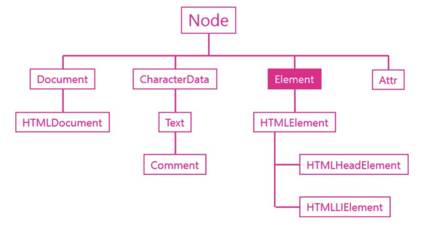

## Element object

Element객체는 엘리먼트를 추상화한 객체다. HTMLELement 객체와의 관계를 이해하기 위해서는 DOM의 취지에 대한 이해가 선행되야 한다. DOM은 HTML만을 제어하기 위한 모델이아니다. HTML이나 XML, SVG, XUL과 같이 마크업 형태의 언어를 제어하기 위한 규격이기 때문에 Element는 마크업 언어의 일반적인 규격에 대한 속성을 정의하고 있고, 각각의 구체적인 언어(HTML,XML,SVG)를 위한 기능은 HMTLElement, SVGElement, XULElement와 같은 객체를 통해서 추가해서 사용하고 있다.

## 다른 객체들과의 관계 

## 주요기능

### 식별자

문서내에서 특정한 엘리먼트를 식별하기 위한 용도로 사용되는 API

* Element.classList
* Element.className
* Element.id
* Element.tagName

### 조회

엘리먼트의 하위 엘리먼트를 조회하는 API

* Element.getElementsByClassName
* Element.getElementsByTagName
* Element.querySelector

### 속성

엘리먼트의 속성을 알아내고 변경하는 API

* Element.getAttribute(name)
* Element.setAttribute(name, value)
* Element.hasAttribute(name) // 속성이 있는지 없는지를 확인
* Element.removeAttribute(name);