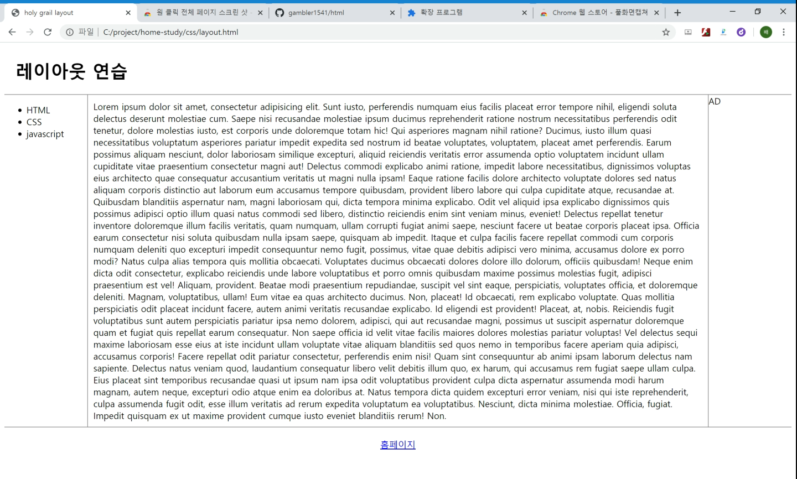
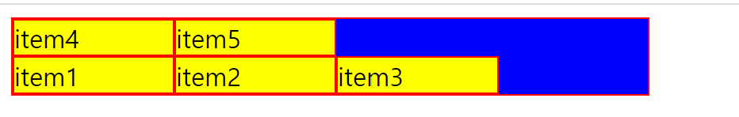

## FLEX

> 레이아웃을 나눌 수 있는 방법

container|item
---|---
display|order
flex|flex-grow|
flex-wrap|flex-shrink
flex-flow|flex-basis
justify-content|flex
align-items|align-selfali
align-content|

* flex를 쓰기 위해서는 부모의(item을 감싸는 컨테이너)의 display속성을 `flex`로 바꿔줘야한다.

### item에 주는 속성
* `flex-basis` : 기본 크기를 지정(방향에 해당하는)

* `flex-grow` : 기본값은 0(아무 변화 없음), 컨테이너의 여백을 item으로 가득채울 수 있음 
	
	* `flex-shrink` : 0으로 줬을 경우 화면이 작아 졌을때 줄어 들지 않음

## Holy Grail Layout

> 화면의 크기에 따라 main의 크기가 작아짐 

> 위 화면 처럼 화면을 구성할 수 있다.

## 기타 속성

Container 속성

* `FLEX-DIRECTION` 
	
	* row
	  
	* row_reverse

	 
 
 	* column
 		
 	* column_reverse
 
 		
 		
* `FLEX-WRAP`
 
 	* nowrap(default) 
 	* wrap : container보다 itme들의 합이 크다면 아랫줄로 이동함
 	
 	
 	
 	* wrap_reverse
 	
 	

* `ALIGN-ITEMS`

	* stretch(default) : 컨테이너에 아이템들이 있고, 그 컨테이너가 flex가 되는 순간 아이템들은 컨테이너의 높이 값이 됨
	* start : 각각의 아이템들이 자신의 컨탠트 크기만큼의(높이) 값을 가짐 
	
	 
	* end 
	
	  
	 
	 * cneter 
	 
	 
	 * baseline : 가상의 밑줄이 생겨 줄을 맞춰줌
	 
	 
	 
* `JUSTIFY-CONTENT`
	* flex-start : 화면의 왼쪽에서 시작 
	
	* flex-end : 화면의 오른쪽에서 시작
	
	* center : 화면의 가운데 정렬

## Item에 부여되는 속성

* `ALIGN-self` : 모든 아이템에 속성을 적용하는 것이 아니라 아이템 각각에 속성을 지정

* `flex` 
	* item {flex: flex-grow [flex-shrink][flex-basis]}
* `order` : 아이템의 순서를 바꿈
