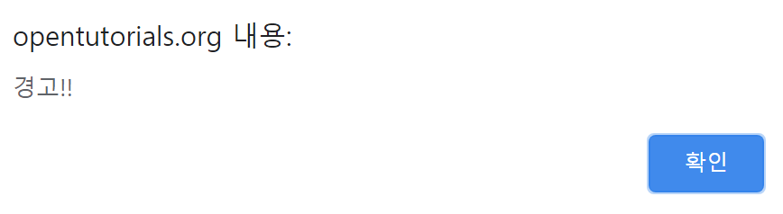
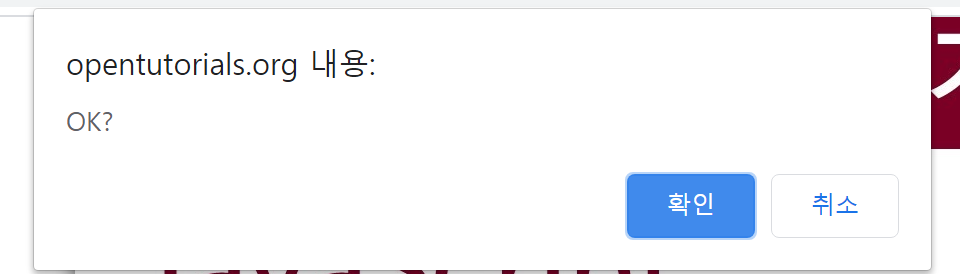
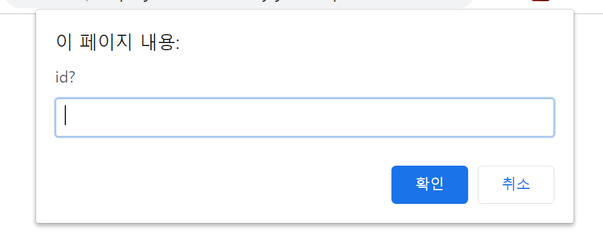

## Window Object

접근 방법

```
window
```

* 전역변수나 전역함수를 생성하면 window의 메소드, 프로퍼티가 된다.


# window method
* `alert` :경고창을 띄움
	* 확인 버튼을 누르지 않으면 뒤에 코드가 실행되지 않는다.


* `confirm` : 확인을 누르면 `true`를 return, 취소를 누르면 `false`를 return 한다.
* 이 특성으로 사용자의 선택에 따라 로직을 분기시킬수 있다.


* `prompt` : 사용자가 입력한 값을 받아서 자바스크립트가 얻어낼 수 있음
	* 사용자가 입력한 값이 return
	
