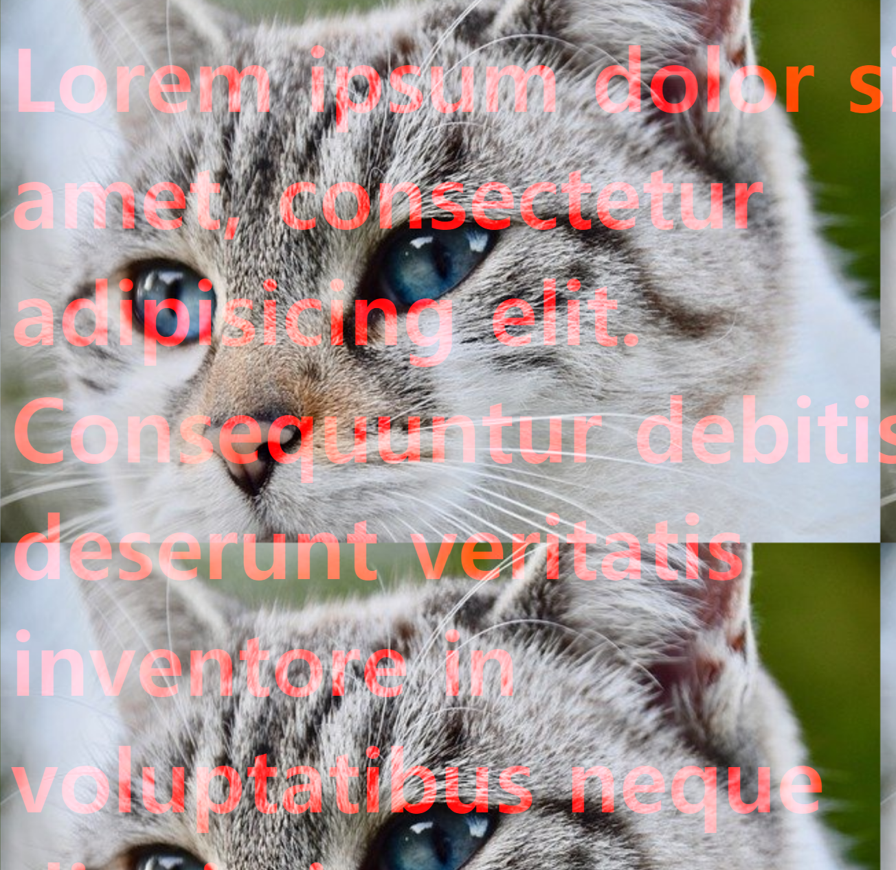

## blend

```
  <style>
      .blend{
        height : 400px;
        border : 5px solid;
        <!-- 아래 두가지를 혼합 -->
        background-color : green;
        background-size : cover;
        background-image : url(../img/cat.jpg);
        background-blend-mode : darken;
      }
```

* background-image 와 background-color를 혼합
* `background-blend-mode` : background효과들을 혼합

* `mixed-blend-mode`

```
<!DOCTYPE html>
<html lang="ko" dir="ltr">
  <head>
    <meta charset="utf-8">
    <title>mixed_blend</title>
    <style>
      body{
        background-image : url(../img/cat.jpg);
      }
      .blend{
        font-size : 2rem;
        font-weight : bold;
        color :red;
        mix-blend-mode : screen;
      }
    </style>
  </head>
  <body>
    <div class="blend">
      <h1>Lorem ipsum dolor sit amet, consectetur adipisicing elit. Consequuntur debitis deserunt veritatis inventore in voluptatibus neque dignissimos perferendis, eaque. Ipsa illum tempora sunt pariatur, maxime distinctio modi. Velit laudantium possimus, dolorum non quibusdam aspernatur sint quis nemo, illo iure cum accusantium porro eius incidunt quos iusto, molestias neque maiores fugiat explicabo nostrum itaque, at voluptatibus numquam sit. Suscipit iste pariatur harum impedit dolores quis sit nesciunt libero atque consectetur ducimus itaque ipsam veritatis odio molestiae expedita, inventore optio id repellat architecto quaerat hic maiores cupiditate. A quia commodi esse molestiae, iure natus. Vitae iure corporis a vero eius, esse, nisi.</h1>
    </div>
  </body>
</html>
```



* blend를 주고싶은 대상과 백그라운드 이미지를 합성하는 모드

<a href="https://codepen.io/"> blend에 관련된 홈페이지</a>