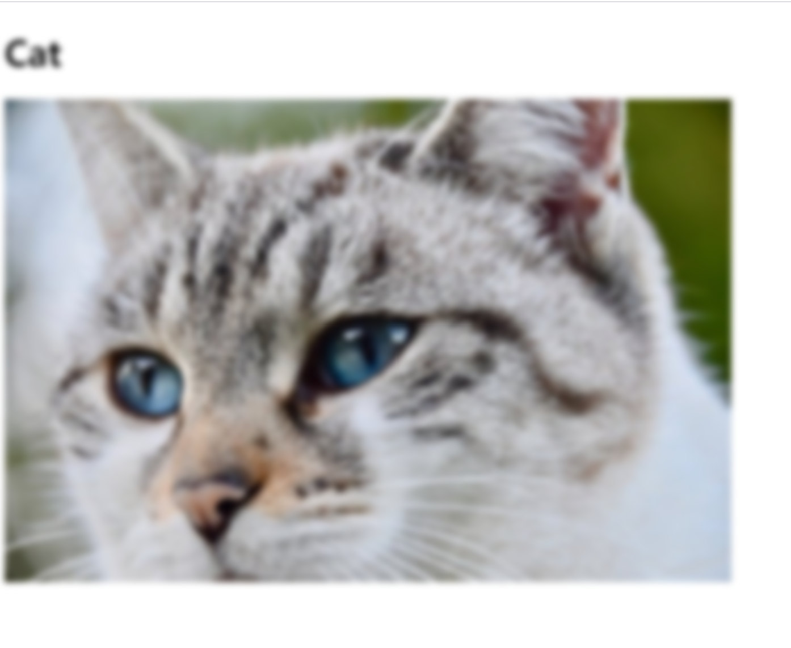

## filter

> 원본 이미지는 그대로 두고 코드를 통해 이미지에 효과를 줌

> 선택하는 대상이 텍스트라면 복사, 붙여넣기 등의 효과를 줄 수 있다.

참고 : <a herf="https://css-playground.com">css playground</a>

```
<!DOCTYPE html>
<html lang="ko" dir="ltr">
  <head>
    <meta charset="utf-8">
    <title>Filter</title>
    <style>
      img{
        WebkitFilter: grayscale(0%)  blur(3px);
        filter: grayscale(0%)  blur(3px);
      }
      h1{
        WebkitFilter: blur(3px);
        filter:blur(3px);
      }
    </style>
  </head>
  <body>
    <h1>Cat</h1>
    
  </body>
</html>
```

 

* blur 효과를 준 모습

```
<!DOCTYPE html>
<html lang="ko" dir="ltr">
  <head>
    <meta charset="utf-8">
    <title>Filter</title>
    <style>
      h1{
        WebkitFilter: blur(3px);
        filter:blur(3px);
      }
      img{
        transition : all 3s;
      }
      img:hover{
        WebkitFilter:grayscale(100%) blur(5px);
        filter:grayscale(100%) blur(1px);
      }
    </style>
  </head>
  <body>
    <h1>Cat</h1>
    
  </body>
</html>

```

* img가 hover 되었을 시 필터가 동작한다.