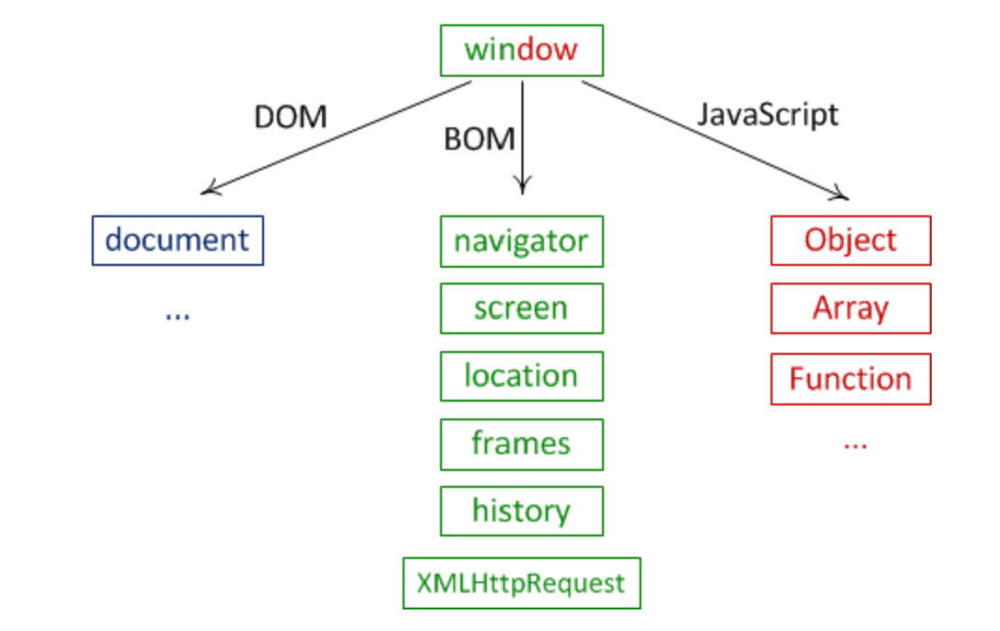

## object model

> 자바스크립트로 웹 브라우저의 태그를 제어하기위해 객체화 시킨다.

* 이미지에 src속성을 통해 이미지를 넣는것은 HTML로 제어한것이다.
* 자바스크립트로 제어하기 위해선 태그자체를 객체로 만든다.
	* 이 객체는 유저가 만드는 것이아니라 로드될때 브라우저가 만든다.
	* 그 객체를 유저가 제어할 수 있다.

```
document.getElementsByTagName('tagName');
document.getElementById('IdName');
document.getElementsByClassName('ClassName');
```

* 각각 태그이름, ID, class명을 선택할 수 있음

## Window object
> 전역 객체, window, frame
 
 * `document` : 윈도우 객체의 프로퍼티(태그를 제어)
  	* `window.document`로 접근 가능(window는 생략가능)


# BOM

> browser object model

* 현재 웹 브라우저가 가리키고있는 url을 알아내거나, 리로드하거나, 경고창을 띄우게 하기 위해 사용
* 윈도우 객체의 프로퍼티에 저장되어 있음
	* navigator
	* screen
	* location
	* frames
	* history
	* XMLHttpRequest

# JavaScriptCore

* 브라우저, app등을 제어할 수 있음
* 자바스크립트가 가진 자체의 객체가 존재
	* Object
	* Array
	* Function

