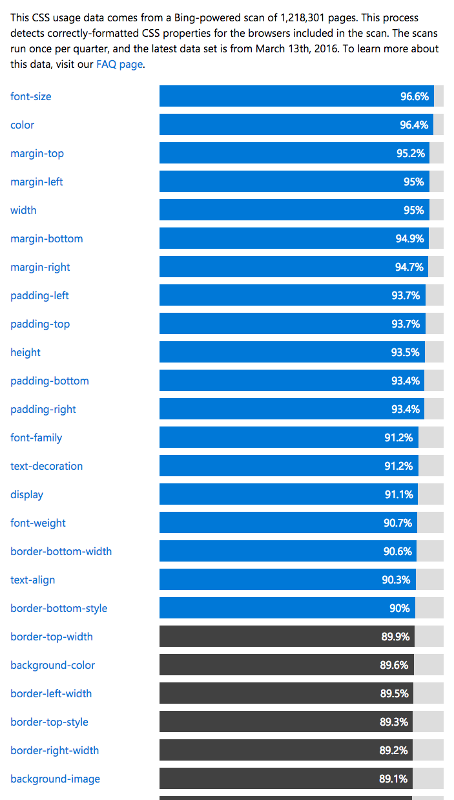

## 속성(Property)

<a href="https://developer.microsoft.com/en-us/microsoft-edge/platform/usage/">속성을 사용하는 빈도수</a>

## font-size

* 단위(unit) : px, em, rem 등
	* px : 고정된 크기를 지정
	* em, rem : 사용자가 크기를 가변적으로 사용
	* 상황에따라 다른걸 쓰지만 `rem`을 많이 사용하게됨
	* 사용자가 글꼴 크기를 바꿨을때 px은 바뀌지 않고, rem은 바뀜
	* em은 부모의 글자크기에 영향을받고 rem은 html태그에 적용된 font-size에 영향을 받는다.

## color 

* 폰트에 색을 주는 property
* 색을 넣는 방법(3가지)
	* color name
	* hex (16진수)
	* rgb (red,green, blue)

## text-align

* 텍스트를 정렬하는 property
	* center
	* left
	* right
	* justify
		* 양쪽이 공평하게 화면을 차지함(양쪽정렬)

## font

* font-family
	* 글꼴을 지정
* font-weigth
	* 글이 진하게 보이게 할 수 있음
* font-height
	* 글의 자간을 설정
* font 
`font: font-style font-variant font-weight font-size/line-height font-family|caption|con|menu|message-box|smaill-caption|stauts-bar|inherit`

<b> 웹 폰트</b>

* link 태그의 href속성에 url을 입력
	* <a href="https://fonts.google.com/">구글 무료 웹폰트</a>